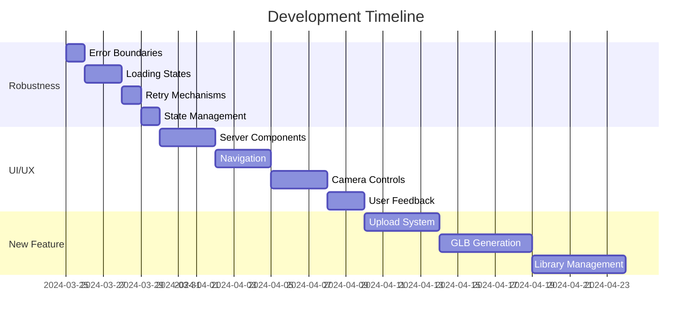

# Modern 3D Viewer - Development Roadmap 2024

## Overview
This document outlines the prioritized development plan for the Modern 3D Viewer application, focusing on stability, user experience, and feature expansion. The priorities are structured to build upon each other, ensuring a solid foundation for future development.

## Priority 1: Improve Application Robustness
**Timeline: 3-5 days**

### Error Handling & Recovery
```typescript
// Implementation of Error Boundaries
class ViewerErrorBoundary extends React.Component {
  state = { hasError: false }
  
  static getDerivedStateFromError(error) {
    return { hasError: true }
  }
  
  render() {
    if (this.state.hasError) {
      return <ErrorFallback />
    }
    return this.props.children
  }
}
```

### Key Improvements
1. **Error Boundaries** ✅ (Completed March 24, 2025)
   - Implement component-level error catching
   - Create meaningful error recovery UIs
   - Add error reporting and logging
   - Preserve user state during errors

2. **Loading States** ✅ (Completed March 24, 2025)
   - Add loading indicators for async operations
   - Implement skeleton loading states
   - Create progress indicators for long operations
   - Handle timeout scenarios

3. **Retry Mechanisms** ✅ (Completed March 24, 2025)
   - Add automatic retry for API calls
   - Implement exponential backoff
   - Create manual retry options
   - Preserve partial progress

4. **State Management** ✅ (Completed March 24, 2025)
   - Add TypeScript types for all state
   - Implement state validation
   - Add state persistence where needed
   - Create state recovery mechanisms

### Success Criteria
- [x] Zero uncaught runtime errors
- [x] All async operations have loading states
- [x] Failed operations have retry mechanisms
- [x] All state changes are type-safe

## Priority 2: UI/UX Improvements
**Timeline: 7-10 days**

### Server-Side Component Migration ✅ (Completed March 24, 2025)
```typescript
// Key Areas for Server Components
1. **Dynamic Routes & Data Fetching**
   - Fix `createServerClient` implementation
   - Update `/viewer/[modelId]` page to use proper async patterns
   - Implement proper params handling in dynamic routes
   - Set up proper error boundaries for SSR failures

2. **State Management**
   - Separate client/server state
   - Implement proper hydration strategies
   - Handle loading and error states
   - Set up proper data revalidation

3. **Authentication Flow**
   - Move auth checks to server components
   - Implement proper session handling
   - Set up middleware for protected routes
```

### Navigation Enhancements ✅ (Completed March 24, 2025)
```typescript
// Example of improved navigation handling
const Navigation = () => {
  const router = useRouter()
  const toast = useToast()
  
  const handleNavigation = async (path: string) => {
    try {
      await router.push(path)
    } catch (error) {
      toast({
        title: "Navigation failed",
        description: "Please try again",
        status: "error"
      })
    }
  }
}
```

### UI Layout Revamp ✅ (Completed March 25, 2025)
1. **Component Reorganization**
   - Optimized Cast container positioning
   - Improved Scene Controls layout
   - Enhanced Camera Animation System placement
   - Strategic Telemetry positioning

2. **Visual Hierarchy**
   - Clear component separation
   - Proper spacing implementation
   - Improved user interaction flow
   - Maintained consistent styling

3. **Technical Implementation**
   - Enhanced state management
   - Proper event handling
   - Z-index layer management
   - Mobile-friendly foundations

### Camera Controls (2-3 days)
1. **More intuitive orbit controls**
2. **Better mobile touch support**
3. **Visual feedback for actions**
4. **Improved constraints**

### User Feedback (1-2 days)
1. **Enhanced toast notifications**
2. **Clear success/error states**
3. **Operation progress tracking**
4. **Helpful error recovery**

### Success Criteria
- [x] Server components properly handle dynamic routes
- [x] No hydration mismatches or warnings
- [x] Navigation feels smooth and reliable
- [x] Camera controls are intuitive
- [x] Users receive clear feedback
- [x] Mobile experience is polished
- [x] UI components are properly positioned and spaced
- [x] Component interactions are intuitive and reliable

## Priority 3: New Feature - Image to GLB
**Timeline: 10-14 days**

### System Components
1. **Image Upload System**
   ```typescript
   interface UploadSystem {
     validateFile: (file: File) => Promise<boolean>
     uploadImage: (file: File) => Promise<string>
     trackProgress: (id: string) => Observable<number>
     handleErrors: (error: UploadError) => void
   }
   ```

2. **GLB Generation**
   ```typescript
   interface GLBGenerator {
     convertToGLB: (imageUrl: string) => Promise<string>
     monitorProgress: (jobId: string) => Observable<Progress>
     setQualityParams: (params: QualitySettings) => void
     handleFailure: (error: GenerationError) => void
   }
   ```

3. **Library Management**
   ```typescript
   interface LibrarySystem {
     saveModel: (glb: GLBFile) => Promise<string>
     listModels: () => Promise<Model[]>
     searchModels: (query: string) => Promise<Model[]>
     deleteModel: (id: string) => Promise<void>
   }
   ```

### Implementation Phases
1. **Phase 1: Upload System (4 days)**
   - File validation
   - Upload progress tracking
   - Error handling
   - Storage management

2. **Phase 2: GLB Generation (5 days)**
   - API integration
   - Progress monitoring
   - Quality controls
   - Error recovery

3. **Phase 3: Library Integration (5 days)**
   - Storage system
   - Metadata handling
   - Search/filter capabilities
   - Access controls

### Success Criteria
- [ ] Users can upload images successfully
- [ ] GLB generation is reliable
- [ ] Library system is functional
- [ ] Integration with existing viewer works

## Priority 4: Model Thumbnails
**Timeline: 5-7 days**

### Feature Overview
Implement automatic thumbnail generation for 3D models in the library view, providing users with visual previews of their models. See detailed documentation in [Model Thumbnails](./features/UI/MODEL_THUMBNAILS.md).

### Implementation Phases
1. **Core Infrastructure (2-3 days)**
   - Create thumbnail generation utility using Three.js
   - Set up Supabase storage for thumbnails
   - Add database schema updates
   - Implement error handling

2. **Integration (2 days)**
   - Add thumbnail generation to upload flow
   - Update ModelGrid component
   - Add loading states
   - Implement error recovery

3. **Optimization (1-2 days)**
   - Add caching layer
   - Implement batch processing
   - Add regeneration capabilities
   - Performance optimization

### Success Criteria
- [ ] Automatic thumbnail generation for new uploads
- [ ] Batch processing for existing models
- [ ] Clear error handling and recovery
- [ ] Responsive UI during generation
- [ ] Proper storage management
- [ ] Efficient caching implementation

## Timeline Overview


## Resource Requirements

### Development Resources
- 1 Full-time developer
- 1 Part-time UX designer (for UI/UX phase)
- 1 Part-time QA engineer

### Infrastructure
- Image storage solution
- GLB processing service
- Enhanced error tracking
- Analytics system

## Risk Assessment

### Technical Risks
1. **GLB Generation Quality**
   - Mitigation: Implement quality checks
   - Fallback: Manual quality adjustment options

2. **Performance Impact**
   - Mitigation: Implement lazy loading
   - Fallback: Reduce feature scope

3. **Storage Costs**
   - Mitigation: Implement file size limits
   - Fallback: User quotas

### Mitigation Strategies
1. Regular testing throughout development
2. Phased rollout of features
3. Monitoring and alerting setup
4. User feedback collection

## Success Metrics

### Technical Metrics
- Error rate < 0.1%
- Page load time < 2s
- GLB generation success > 95%
- API response time < 500ms

### User Metrics
- User satisfaction > 4/5
- Feature adoption > 50%
- Return usage > 70%
- Support tickets < 5/week

## Maintenance Plan

### Regular Tasks
1. Weekly code reviews
2. Daily error log review
3. Monthly performance audit
4. Bi-weekly user feedback review

### Long-term Considerations
1. Scale infrastructure as needed
2. Update dependencies regularly
3. Refine based on usage patterns
4. Implement user suggestions

## Conclusion
This roadmap provides a structured approach to improving and expanding the Modern 3D Viewer application. By prioritizing stability and user experience before adding new features, we ensure a solid foundation for future development. Regular reviews and adjustments to this plan will be necessary as development progresses. 