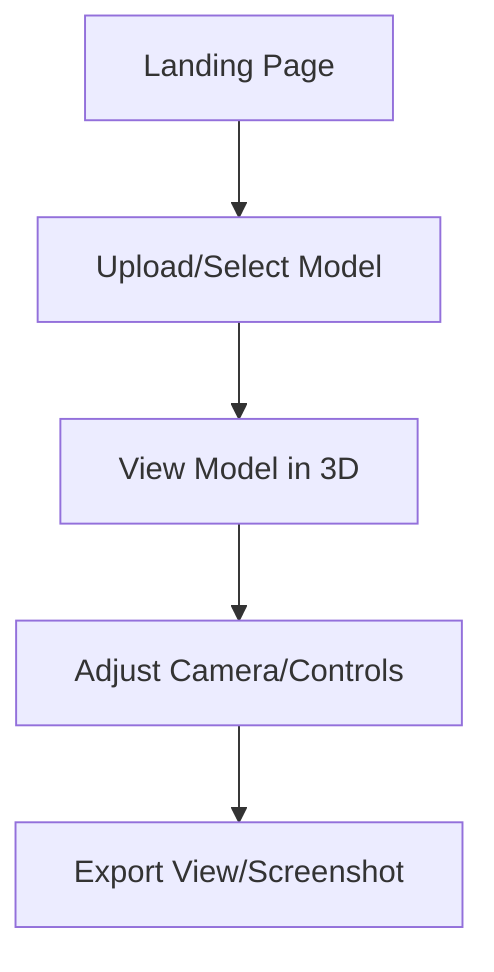
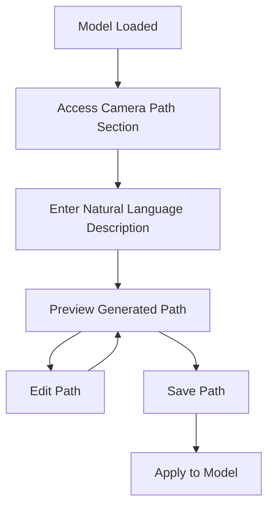

### **Content for: `PRD.md` (Leaner Version)**

```markdown
# Modern 3D Viewer - Product Requirements Document

## 1. Product Overview

### Purpose
A web-based 3D model viewer with AI-powered camera path generation and model creation capabilities, designed to provide intuitive controls with a modern UI.

### Core Value Proposition
Automate and simplify the creation of professional 3D model presentations through:
- Intelligent camera path generation via LLM
- AI-powered 3D model generation from images
- Real-time 3D visualization and interaction
- Intuitive, accessible UI powered by modern component libraries (e.g., shadcn).

### Target Users
- 3D artists and designers
- Content creators
- Digital marketers
- Web developers
- Product showcase teams

### Success Metrics
- Average session duration > 5 minutes
- Camera path generation usage > 20% of sessions
- User retention (return visits) > 30%
- Model export rate > 10% of uploads
- User satisfaction score > 4/5 (via surveys/feedback)
- Error rate < 0.1%

## 2. User Experience Flow

### Core User Journeys

#### 1. Basic Model Viewing


#### 2. AI Camera Path Generation


#### 3. AI Model Generation
```mermaid
graph TD
    A[Landing Page] --> B[Select Image-to-3D]
    B --> C[Upload Reference Image(s)]
    C --> D[Configure Generation Parameters]
    D --> E[Process with AI]
    E --> F[Preview Generated Model]
    F --> G1[Edit/Refine]
    F --> G2[Save to Library]
    G1 --> E
```

## 3. Core Features

### A. 3D Viewer (Base Feature)
- Real-time 3D model rendering (targeting WebGL 2.0).
- Intuitive camera controls (orbit, pan, zoom) and support for smooth camera animations.
- Support for common 3D model formats (initially focusing on glTF/GLB).
- Basic PBR texture management.
- Options for simple environment setup (e.g., floor grids, basic lighting).
- Display of real-time camera telemetry data.
- Basic export functionality (e.g., screenshots).

### B. AI Camera Path Generation
- **Concept:** Allow users to generate smooth, cinematic camera paths based on natural language prompts.
- **Core Functionality:**
  - Input: Text prompt describing desired camera movement (e.g., "Orbit the model slowly", "Zoom in on the top feature").
  - Process: Utilize an AI Assistant (currently OpenAI Assistants API) with a custom Motion Knowledge Base and scene context to generate a structured `MotionPlan`.
  - Execution: A deterministic `SceneInterpreter` uses the `MotionPlan` and detailed local scene/environmental context to calculate precise camera keyframes, enforcing constraints.
  - Output: Smooth camera animation played back in the viewer.
- **Key User Features:**
  - Natural language control.
  - Scene-aware path generation (respecting boundaries).
  - Interactive preview.
  - (Future) Path editing capabilities.
  - (Future) Export options.

*(For detailed technical architecture and current implementation, see the [P2P Pipeline Architecture](../features/camera-animation/ARCHITECTURE.md))*

### C. AI Model Generation
- Capability to generate 3D models from user-provided images (Image-to-3D).
- Support for different generation styles or quality levels.
- Preview generated models before saving.
- Integration with the user's model library.
- Model optimization options (e.g., decimation, texture compression).

## 4. UI Design Concepts
- **Layout:** A clean, modern layout featuring a primary 3D viewport and accessible control panels. Typically, controls might reside in sidebars or contextual panels.
- **Component Library:** Utilize a modern component library like shadcn/ui for consistency, accessibility, and themeability (supporting light/dark modes).
- **Control Panels:** Intuitive panels for model selection/upload, scene setup, camera controls, AI feature interaction, and export options.
- **Responsiveness:** The UI should adapt gracefully to different screen sizes, including desktop and mobile devices, potentially simplifying controls or layout on smaller screens.

*(For detailed technical implementation, component code, and specific layout structures, see the [Technical Design Document](./TECHNICAL_DESIGN.md))*

## 5. Security & Authentication Requirements
- Secure user authentication and session management.
- Protection for user-uploaded assets (models, textures).
- Role-based access control (if applicable, e.g., for team features).
- Adherence to best practices for web security (CSRF, XSS prevention).

*(For detailed architecture and implementation, see the [Technical Design Document](./TECHNICAL_DESIGN.md) and [Authentication Feature Documentation](./features/auth/README.md))*

## 6. Error Handling & Edge Cases
- The application must handle errors gracefully (e.g., network issues, AI service failures, rendering problems).
- Provide clear, user-friendly feedback for errors.
- Implement fallback strategies where possible (e.g., default camera paths if AI fails).
- Address edge cases like very large models, invalid uploads, or unsupported browser features.

*(For detailed error handling strategy and implementation, see the [Technical Design Document](./TECHNICAL_DESIGN.md))*

## 7. Performance Requirements
- Smooth rendering performance (aiming for 30-60 FPS) on target hardware.
- Reasonable load times for models and the application itself.
- Efficient use of memory and GPU resources.
- Responsive UI interactions.

## 8. Accessibility Requirements
- Adherence to WCAG 2.1 AA guidelines where applicable.
- Keyboard navigability for UI controls.
- Sufficient color contrast, especially in different themes (light/dark/high-contrast).
- Screen reader compatibility for key UI elements and information.
- Consider alternative input methods for 3D interaction where feasible.

*(For detailed implementation examples, see the [Technical Design Document](./TECHNICAL_DESIGN.md))*

## 9. Business Model & Metrics
- **Potential Monetization:** Tiered subscription model (Free, Pro, Enterprise) based on feature access, usage limits (e.g., AI credits, storage), or collaboration features.
- **Key Metrics:** Track user engagement, feature adoption, performance, retention, and conversion rates as defined in Success Metrics (Section 1).

*(For technical implementation of analytics, see the [Technical Design Document](./TECHNICAL_DESIGN.md))*

## 10. Development Roadmap
- See the [Development Roadmap](./DEVELOPMENT_ROADMAP.md) for the planned phases and timeline.

## 11. Browser & Device Support
- **Target Browsers:** Latest versions of Chrome, Firefox, Safari, Edge.
- **Target Devices:** Desktop computers (recommended), modern tablets and smartphones (with potential performance/feature trade-offs).
- **Minimum Hardware:** WebGL 1.0 support, 4GB RAM (recommend WebGL 2.0, 8GB+ RAM for optimal experience).

## 12. Conclusion
The Modern 3D Viewer aims to provide a powerful yet intuitive platform for visualizing and presenting 3D models, enhanced by AI capabilities. By focusing on a clean user experience, robust technical foundation, and intelligent features, the product seeks to streamline workflows for creative professionals and other target users.
