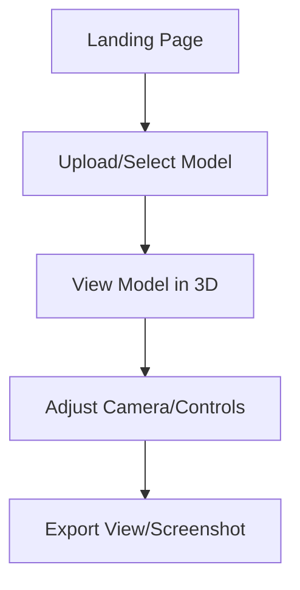

### **Content for: `PRD.md` (Leaner Version)**

```markdown
# QWK Shot - Product Requirements Document

## 1. Product Overview

### Purpose
To empower novice users to easily manipulate 3D models and generate captivating still and motion content, bridging the gap between complex professional 3D software and the growing accessibility of AI-generated assets.

### Core Value Proposition
Provide a focused, low-overhead utility that simplifies the creation of cinematic "hero" content from 3D assets by offering:
- AI-powered, intuitive camera path generation via natural language.
- Streamlined real-time 3D visualization and interaction.
- An accessible, modern UI designed for users without extensive 3D software experience.

### Target Users
- 3D artists and designers
- Content creators
- Digital marketers
- Web developers
- Product showcase teams

### Success Metrics
- Average session duration > 5 minutes
- Camera path generation usage > 20% of sessions
- User retention (return visits) > 30%
- Animation/Video export rate > 10% of camera paths generated
- Error rate < 0.1%

## 2. User Experience Flow

### Core User Journeys

#### 1. Basic Model Viewing


#### 2. AI Camera Path Generation
```mermaid
graph TD
    A[Model Loaded] --> B[Locks Camera Position]
    B --> C[Enters Natural Language Prompt]
    C --> D[Animation Generated (Preview, Play, Adjust Speed)]
    D --> E[Downloads Video (Optional)]
    D --> C // Re-prompt if not satisfied
```

## 3. Core Features

### A. 3D Viewer (Base Feature)
- Real-time rendering of uploaded or library-selected 3D models (targeting WebGL 2.0).
- Intuitive camera controls (orbit, pan, zoom) and support for smooth camera animations.
- Support for glTF/GLB, common 3D model formats for web-based viewing.
- Renders models utilizing their embedded PBR materials.
- Environment customization: configurable canvas color, grid display, and custom texture uploads for the floor plane.
- Basic export functionality (e.g., screenshots).

### B. AI Camera Path Generation
- **Concept:** Allow users to generate smooth, cinematic camera paths based on natural language prompts.
- **Core Functionality:**
  - Input: Text prompt describing desired camera movement (e.g., "Orbit the model slowly", "Zoom in on the top feature").
  - Process: Utilize an AI Assistant (currently OpenAI Assistants API) with a custom Motion Knowledge Base and scene context to generate a structured `MotionPlan`.
  - Execution: A deterministic `SceneInterpreter` uses the `MotionPlan` and detailed local scene/environmental context to calculate precise camera keyframes, enforcing constraints.
  - Output: Smooth camera animation played back in the viewer.
- **Key User Features:**
  - Natural language control.
  - Scene-aware path generation (respecting boundaries).
  - Interactive preview.
  - (Future) Path editing capabilities.
  - (Future) Export options.

*(For detailed technical architecture and current implementation, see the [P2P Pipeline Architecture](../features/camera-animation/ARCHITECTURE.md))*

## 4. UI Design Concepts
- **Layout:** A clean, modern layout featuring a primary 3D viewport and accessible control panels. Typically, controls might reside in sidebars or contextual panels.
- **Control Panels:** Intuitive panels for model selection/upload, scene setup, camera controls, AI feature interaction, and export options.
- **Responsiveness:** The UI is responsive for various desktop screen sizes. Mobile devices are not officially supported.

*(For detailed technical implementation, component code, and specific layout structures, see the [Technical Design Document](./TECHNICAL_DESIGN.md))*

## 5. Security & Authentication Requirements
- Secure user authentication and session management.
- Protection for user-uploaded assets (models, textures).
- Role-based access control (if applicable, e.g., for team features).
- Adherence to best practices for web security (CSRF, XSS prevention).

*(For detailed architecture and implementation, see the [Technical Design Document](./TECHNICAL_DESIGN.md) and [Authentication Feature Documentation](./features/auth/README.md))*

## 6. Error Handling & Edge Cases
- The application must handle errors gracefully (e.g., network issues, AI service failures, rendering problems).
- Provide clear, user-friendly feedback for errors.
- Implement fallback strategies where possible (e.g., default camera paths if AI fails).
- Address edge cases like very large models, invalid uploads, or unsupported browser features.

*(For detailed error handling strategy and implementation, see the [Technical Design Document](./TECHNICAL_DESIGN.md))*

## 7. Performance Requirements
- Smooth rendering performance (aiming for 30-60 FPS) on target hardware.
- Reasonable load times for models and the application itself.
- Efficient use of memory and GPU resources.
- Responsive UI interactions.

## 8. Accessibility Requirements
- Adherence to WCAG 2.1 AA guidelines where applicable.
- Keyboard navigability for UI controls.
- Sufficient color contrast, especially in different themes (light/dark/high-contrast).
- Screen reader compatibility for key UI elements and information.
- Consider alternative input methods for 3D interaction where feasible.

*(For detailed implementation examples, see the [Technical Design Document](./TECHNICAL_DESIGN.md))*

## 9. Business Model & Metrics
- **Potential Monetization:** Tiered subscription model (Free, Pro, Enterprise) based on feature access, usage limits (e.g., AI credits, storage), or collaboration features.
- **Key Metrics:** Track user engagement, feature adoption, performance, retention, and conversion rates as defined in Success Metrics (Section 1).

*(For technical implementation of analytics, see the [Technical Design Document](./TECHNICAL_DESIGN.md))*

## 10. Development Roadmap
- See the [Development Roadmap](./DEVELOPMENT_ROADMAP.md) for the planned phases and timeline.

## 11. Browser & Device Support
- **Target Browsers:** Latest versions of Chrome, Firefox, Safari, Edge.
- **Target Devices:** Desktop computers (recommended), modern tablets and smartphones (with potential performance/feature trade-offs).
- **Minimum Hardware:** WebGL 1.0 support, 4GB RAM (recommend WebGL 2.0, 8GB+ RAM for optimal experience).

## 12. Conclusion
QWK Shot is dedicated to empowering users, especially those new to 3D, to effortlessly create compelling visual content from their 3D models. By offering an intuitive, focused utility with AI-driven camera automation, it bridges the gap between complex professional software and the increasing availability of 3D assets. QWK Shot aims to streamline the creation of cinematic presentations, making high-quality 3D visualization accessible to a broader audience, including content creators, marketers, and anyone looking to showcase 3D assets without a steep learning curve.
