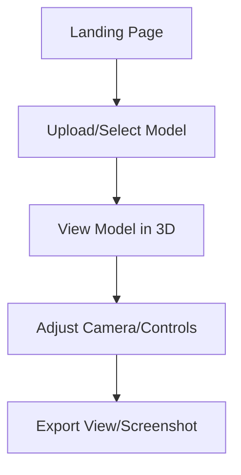
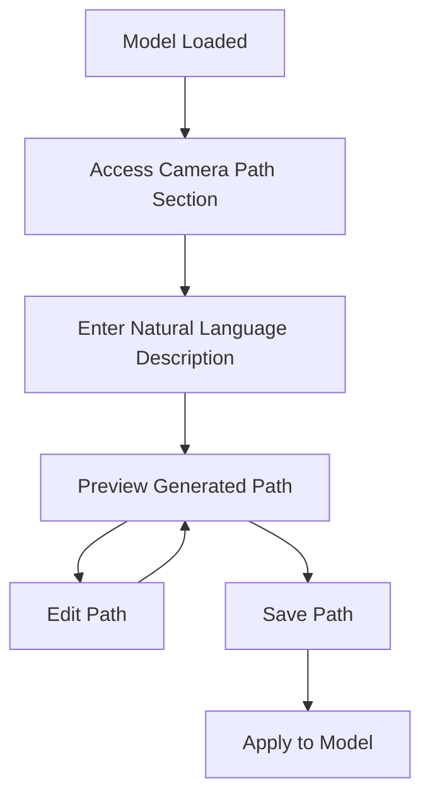

# Modern 3D Viewer - Enhanced PRD & Technical Documentation

## 1. Product Overview

### Purpose
A web-based 3D model viewer with AI-powered camera path generation and model creation capabilities, designed to provide intuitive controls with a modern UI.

### Core Value Proposition
Automate and simplify the creation of professional 3D model presentations through:
- Intelligent camera path generation via LLM
- AI-powered 3D model generation from images
- Real-time 3D visualization and interaction
- Intuitive, accessible UI powered by shadcn components

### Target Users
- 3D artists and designers
- Content creators
- Digital marketers
- Web developers
- Product showcase teams

### Success Metrics
- Average session duration >5 minutes
- Camera path generation usage >20% of sessions
- User retention (return visits) >30%
- Model export rate >10% of uploads

## 2. User Experience Flow

### Core User Journeys

#### 1. Basic Model Viewing


#### 2. AI Camera Path Generation


#### 3. AI Model Generation
```mermaid
graph TD
    A[Landing Page] --> B[Select Image-to-3D]
    B --> C[Upload Reference Image(s)]
    C --> D[Configure Generation Parameters]
    D --> E[Process with AI]
    E --> F[Preview Generated Model]
    F --> G1[Edit/Refine]
    F --> G2[Save to Library]
    G1 --> E
```

## 3. Core Features

### A. 3D Viewer (Base Feature)
- Real-time 3D model rendering with WebGL 2.0
- Advanced camera controls and animations
- Model texture management with PBR support
- Terrain/environment options with customizable lighting
- Camera telemetry display with real-time updates
- Export functionality (screenshots, model, animations)

### B. AI Camera Path Generation
- Natural language input for camera movements
- Scene geometry analysis for intelligent path finding
- Automated camera path creation with editable keyframes
- Real-time path preview and visual editing
- Path management system with library and sharing options

### C. AI Model Generation
- Image-to-3D model conversion with multiple styles
- Multi-view support for improved quality
- Model preview and validation tools
- Automatic model optimization (decimation, texture compression)
- Direct integration into viewer
- Model management system with versioning

## 4. UI Design & Components

### A. Overall Layout

```tsx
// Main Application Layout
const AppLayout = () => {
  return (
    <div className="h-screen flex flex-col">
      <header className="border-b border-border h-14 flex items-center px-4">
        <div className="flex-1">
          <h1 className="text-xl font-bold">Modern 3D Viewer</h1>
        </div>
        <NavigationMenu className="hidden md:flex">
          <NavigationMenuList>
            <NavigationMenuItem>
              <NavigationMenuLink>Viewer</NavigationMenuLink>
            </NavigationMenuItem>
            <NavigationMenuItem>
              <NavigationMenuLink>Generate</NavigationMenuLink>
            </NavigationMenuItem>
            <NavigationMenuItem>
              <NavigationMenuLink>Library</NavigationMenuLink>
            </NavigationMenuItem>
          </NavigationMenuList>
        </NavigationMenu>
        <div className="flex items-center gap-2">
          <ModeToggle />
          <UserNav />
        </div>
      </header>
      
      <div className="flex-1 flex overflow-hidden">
        <div className="w-80 border-r border-border p-4 overflow-y-auto">
          <Sidebar />
        </div>
        <div className="flex-1 relative">
          <ViewerCanvas />
        </div>
      </div>
    </div>
  );
};
```

### B. Control Panel with shadcn Components

```tsx
// Model Controls Component
const ModelControls = () => {
  const { models, currentModel, setCurrentModel } = useModels();
  const { textures, currentTexture, setCurrentTexture } = useTextures();
  
  return (
    <Card>
      <CardHeader>
        <CardTitle>Model Controls</CardTitle>
        <CardDescription>Adjust model settings and appearance</CardDescription>
      </CardHeader>
      <CardContent className="space-y-4">
        <div className="space-y-2">
          <Label htmlFor="model-select">Model</Label>
          <Select 
            value={currentModel} 
            onValueChange={setCurrentModel}
          >
            <SelectTrigger id="model-select">
              <SelectValue placeholder="Select model" />
            </SelectTrigger>
            <SelectContent>
              {models.map(model => (
                <SelectItem key={model.id} value={model.id}>
                  {model.name}
                </SelectItem>
              ))}
            </SelectContent>
          </Select>
        </div>
        
        <div className="space-y-2">
          <Label htmlFor="texture-select">Texture</Label>
          <Select 
            value={currentTexture} 
            onValueChange={setCurrentTexture}
          >
            <SelectTrigger id="texture-select">
              <SelectValue placeholder="Select texture" />
            </SelectTrigger>
            <SelectContent>
              {textures.map(texture => (
                <SelectItem key={texture.id} value={texture.id}>
                  {texture.name}
                </SelectItem>
              ))}
            </SelectContent>
          </Select>
        </div>
      </CardContent>
    </Card>
  );
};
```

### C. Camera Path Controls

```tsx
// Camera Path Component
const CameraPathControls = () => {
  const { 
    paths, 
    currentPath, 
    setCurrentPath, 
    isAnimating, 
    startAnimation, 
    stopAnimation,
    orbitDistance,
    setOrbitDistance,
    orbitHeight,
    setOrbitHeight,
    animationSpeed,
    setAnimationSpeed
  } = useCameraPath();
  
  return (
    <Card>
      <CardHeader>
        <CardTitle>Camera Path</CardTitle>
        <CardDescription>Control camera movement and animation</CardDescription>
      </CardHeader>
      <CardContent className="space-y-4">
        <div className="space-y-2">
          <Label htmlFor="path-select">Camera Path</Label>
          <Select 
            value={currentPath} 
            onValueChange={setCurrentPath}
          >
            <SelectTrigger id="path-select">
              <SelectValue placeholder="Select path" />
            </SelectTrigger>
            <SelectContent>
              <SelectItem value="orbit">Orbit Around Model</SelectItem>
              <SelectItem value="showcase">Product Showcase</SelectItem>
              <SelectItem value="details">Detail Examination</SelectItem>
              {paths.map(path => (
                <SelectItem key={path.id} value={path.id}>
                  {path.name}
                </SelectItem>
              ))}
            </SelectContent>
          </Select>
        </div>
        
        <div className="space-y-2">
          <div className="flex justify-between">
            <Label htmlFor="orbit-distance">Orbit Distance</Label>
            <span>{orbitDistance}</span>
          </div>
          <Slider
            id="orbit-distance"
            min={2}
            max={20}
            step={0.5}
            value={[orbitDistance]}
            onValueChange={([value]) => setOrbitDistance(value)}
          />
        </div>
        
        <div className="space-y-2">
          <div className="flex justify-between">
            <Label htmlFor="orbit-height">Orbit Height</Label>
            <span>{orbitHeight}</span>
          </div>
          <Slider
            id="orbit-height"
            min={-5}
            max={10}
            step={0.5}
            value={[orbitHeight]}
            onValueChange={([value]) => setOrbitHeight(value)}
          />
        </div>
        
        <div className="space-y-2">
          <div className="flex justify-between">
            <Label htmlFor="animation-speed">Animation Speed</Label>
            <span>{animationSpeed}x</span>
          </div>
          <Slider
            id="animation-speed"
            min={0.5}
            max={2}
            step={0.1}
            value={[animationSpeed]}
            onValueChange={([value]) => setAnimationSpeed(value)}
          />
        </div>
        
        <div className="flex space-x-2">
          <Button 
            onClick={startAnimation}
            disabled={isAnimating}
            className="flex-1"
          >
            <Play className="mr-2 h-4 w-4" />
            Start Path
          </Button>
          <Button 
            onClick={stopAnimation}
            disabled={!isAnimating}
            variant="outline"
            className="flex-1"
          >
            <Stop className="mr-2 h-4 w-4" />
            Stop Path
          </Button>
        </div>
      </CardContent>
    </Card>
  );
};
```

### D. Terrain Options

```tsx
// Terrain Controls Component
const TerrainControls = () => {
  const { 
    terrainType, 
    setTerrainType 
  } = useTerrain();
  
  return (
    <Card>
      <CardHeader>
        <CardTitle>Terrain Options</CardTitle>
        <CardDescription>Adjust background and environment</CardDescription>
      </CardHeader>
      <CardContent>
        <RadioGroup 
          value={terrainType} 
          onValueChange={setTerrainType}
          className="space-y-1"
        >
          <div className="flex items-center space-x-2">
            <RadioGroupItem value="basic-grid" id="basic-grid" />
            <Label htmlFor="basic-grid">Basic Grid</Label>
          </div>
          <div className="flex items-center space-x-2">
            <RadioGroupItem value="large-grid" id="large-grid" />
            <Label htmlFor="large-grid">Large Grid</Label>
          </div>
          <div className="flex items-center space-x-2">
            <RadioGroupItem value="textured-grid" id="textured-grid" />
            <Label htmlFor="textured-grid">Textured Grid</Label>
          </div>
          <div className="flex items-center space-x-2">
            <RadioGroupItem value="undulating-grid" id="undulating-grid" />
            <Label htmlFor="undulating-grid">Undulating Grid</Label>
          </div>
          <div className="flex items-center space-x-2">
            <RadioGroupItem value="no-terrain" id="no-terrain" />
            <Label htmlFor="no-terrain">No Terrain</Label>
          </div>
        </RadioGroup>
      </CardContent>
    </Card>
  );
};
```

### E. AI Path Generation Interface

```tsx
// AI Path Generation Component
const AIPathGenerator = () => {
  const [prompt, setPrompt] = useState("");
  const [isGenerating, setIsGenerating] = useState(false);
  
  const handleGenerate = async () => {
    setIsGenerating(true);
    // LLM integration logic here
    await new Promise(r => setTimeout(r, 2000)); // Simulate processing
    setIsGenerating(false);
  };
  
  return (
    <Card>
      <CardHeader>
        <CardTitle>AI Camera Path</CardTitle>
        <CardDescription>
          Describe the camera movement you want in natural language
        </CardDescription>
      </CardHeader>
      <CardContent className="space-y-4">
        <Textarea
          placeholder="Example: Slowly orbit around the model, focusing on details on the right side, then zoom out to show the full object"
          value={prompt}
          onChange={(e) => setPrompt(e.target.value)}
          rows={4}
        />
        
        <div className="space-y-2">
          <div className="flex justify-between items-center">
            <Label>Path complexity</Label>
            <Tooltip>
              <TooltipTrigger asChild>
                <InfoCircle className="h-4 w-4 text-muted-foreground" />
              </TooltipTrigger>
              <TooltipContent>
                Higher complexity means more keyframes and detailed movements
              </TooltipContent>
            </Tooltip>
          </div>
          <Select defaultValue="medium">
            <SelectTrigger>
              <SelectValue placeholder="Select complexity" />
            </SelectTrigger>
            <SelectContent>
              <SelectItem value="simple">Simple (3-5 keyframes)</SelectItem>
              <SelectItem value="medium">Medium (5-10 keyframes)</SelectItem>
              <SelectItem value="complex">Complex (10+ keyframes)</SelectItem>
            </SelectContent>
          </Select>
        </div>
        
        <Button 
          onClick={handleGenerate} 
          disabled={isGenerating || !prompt}
          className="w-full"
        >
          {isGenerating ? (
            <>
              <Loader2 className="mr-2 h-4 w-4 animate-spin" />
              Generating Path...
            </>
          ) : (
            <>
              <Sparkles className="mr-2 h-4 w-4" />
              Generate Camera Path
            </>
          )}
        </Button>
      </CardContent>
    </Card>
  );
};
```

## 5. Technical Architecture

### A. Frontend Architecture

```
src/
├── app/
│   ├── layout.tsx           // Main app layout with theme provider
│   ├── page.tsx             // Landing page
│   ├── viewer/
│   │   ├── page.tsx         // 3D viewer page
│   │   └── [...modelId]/    // Specific model viewer
│   ├── generate/
│   │   ├── page.tsx         // Generation options page
│   │   ├── model/           // Model generation
│   │   └── path/            // Path generation
│   └── library/
│       └── page.tsx         // User model library
├── components/
│   ├── ui/                  // shadcn components
│   ├── viewer/
│   │   ├── ModelViewer.tsx  // Main 3D viewport
│   │   ├── CameraControls.tsx
│   │   ├── ModelControls.tsx
│   │   └── TerrainControls.tsx
│   ├── ai/
│   │   ├── PathGenerator.tsx
│   │   └── ModelGenerator.tsx
│   └── shared/
│       ├── Layout.tsx
│       ├── LoadingStates.tsx
│       └── Telemetry.tsx
├── lib/
│   ├── three/              // Three.js utilities
│   ├── ai/                 // AI service wrappers
│   └── utils/              // Shared utilities
├── hooks/
│   ├── useViewerState.ts   // Core viewer state hook
│   ├── useCameraPath.ts    // Camera path manager
│   └── useModelGeneration.ts
└── store/
    ├── viewerStore.ts      // Main state store
    ├── modelStore.ts       // Model management
    └── userStore.ts        // User preferences
```

### B. State Management

```typescript
// Core State Interface (Zustand store)
interface ViewerState {
  // Scene State
  scene: THREE.Scene | null;
  camera: THREE.PerspectiveCamera | null;
  renderer: THREE.WebGLRenderer | null;
  controls: OrbitControls | null;
  
  // Model State
  models: Model[];
  currentModelId: string | null;
  setCurrentModelId: (id: string | null) => void;
  loadModel: (path: string) => Promise<void>;
  
  // Camera Path State
  cameraPaths: CameraPath[];
  currentPathId: string | null;
  isAnimating: boolean;
  startAnimation: () => void;
  stopAnimation: () => void;
  
  // Generation State
  generationStatus: GenerationStatus;
  generateCameraPath: (prompt: string) => Promise<void>;
  generateModel: (image: File) => Promise<void>;
  
  // Terrain State
  terrainType: TerrainType;
  setTerrainType: (type: TerrainType) => void;
  
  // UI State
  isMobileMenuOpen: boolean;
  toggleMobileMenu: () => void;
  activeTab: 'model' | 'camera' | 'terrain' | 'ai';
  setActiveTab: (tab: 'model' | 'camera' | 'terrain' | 'ai') => void;
}

// Create store
const useViewerStore = create<ViewerState>((set, get) => ({
  // Implementation details...
}));
```

### C. API Structure

```typescript
// API Routes
/api/
├── auth/                   // Authentication endpoints
│   ├── signin              // Sign in
│   ├── signout             // Sign out
│   └── session             // Session validation
├── camera-paths/
│   ├── generate            // LLM path generation
│   ├── validate            // Path validation
│   └── [id]                // Path CRUD operations
├── models/
│   ├── upload              // Model upload
│   ├── generate            // Image-to-3D conversion
│   ├── optimize            // Model optimization
│   └── [id]                // Model CRUD operations
├── scene/
│   ├── geometry            // Scene geometry analysis
│   └── export              // Scene export
└── user/
    ├── preferences         // User settings
    └── library             // User model library
```

## 6. Feature Specifications

### A. Camera Path Generation

```typescript
interface CameraPath {
  id: string;
  name: string;
  description: string;
  points: CameraPoint[];
  metadata: {
    generatedFrom?: string;  // Original prompt
    authorId: string;
    timestamp: number;
    version: string;
  };
  isPublic: boolean;
}

interface CameraPoint {
  position: Vector3;
  rotation: Euler;
  timestamp: number;
  focalLength?: number;
  easing: 'linear' | 'ease-in' | 'ease-out' | 'ease-in-out' | 'cubic';
  duration?: number;  // Time to next point in seconds
}

// Path Generation Parameters
interface PathGenerationParams {
  prompt: string;
  sceneGeometry: SceneGeometry;
  complexity: 'simple' | 'medium' | 'complex';
  duration: number;  // Total desired animation time
  constraints: {
    avoidClipping: boolean;
    maintainHorizon: boolean;
    smoothTransitions: boolean;
    loopable: boolean;
  };
}
```

### B. Model Generation

```typescript
interface ModelGeneration {
  id: string;
  name: string;
  sourceImages: string[];  // URLs to source images
  status: 'pending' | 'processing' | 'complete' | 'failed';
  progress: number;  // 0-100
  modelPath?: string;
  thumbnailPath?: string;
  metadata: {
    resolution: number;
    polygonCount: number;
    textureResolution: number;
    generationParams: GenerationParams;
    processingTime: number;  // In seconds
  };
  error?: {
    code: string;
    message: string;
  };
}

interface GenerationParams {
  quality: 'draft' | 'standard' | 'high';
  style: 'realistic' | 'stylized' | 'low-poly';
  background: 'auto-remove' | 'keep';
  texturing: 'auto' | 'basic' | 'detailed';
  scale: number;  // Model scale factor
  orientation: 'auto' | 'manual';
}
```

## 7. External Integrations

### A. LLM Integration

```typescript
interface LLMService {
  // Camera Path Generation
  generateCameraPath(params: PathGenerationParams): Promise<CameraPath>;
  
  // Natural Language Scene Analysis
  analyzeScene(sceneData: SceneData): Promise<SceneAnalysis>;
  
  // Path Descriptions
  describePath(path: CameraPath): Promise<string>;
}

// Implementation Example
class OpenAILLMService implements LLMService {
  private client: OpenAIApi;
  
  constructor(apiKey: string) {
    this.client = new OpenAIApi(new Configuration({ apiKey }));
  }
  
  async generateCameraPath(params: PathGenerationParams): Promise<CameraPath> {
    const prompt = this.buildPathPrompt(params);
    
    const response = await this.client.createChatCompletion({
      model: "gpt-4",
      messages: [
        { role: "system", content: "You are a camera path generation assistant..." },
        { role: "user", content: prompt }
      ],
      response_format: { type: "json_object" },
      temperature: 0.7,
    });
    
    const result = JSON.parse(response.data.choices[0].message.content);
    return this.processPathResponse(result, params);
  }
  
  // Other methods...
}
```

### B. Model Generation Service

```typescript
interface ModelGenerationService {
  // Generate 3D model from image(s)
  generateFromImages(params: {
    images: File[];
    options: GenerationParams;
  }): Promise<{
    jobId: string;
    estimatedTime: number;
  }>;
  
  // Check generation status
  checkStatus(jobId: string): Promise<{
    status: 'pending' | 'processing' | 'complete' | 'failed';
    progress: number;
    result?: ModelGenerationResult;
    error?: string;
  }>;
  
  // Download generated model
  downloadModel(jobId: string, format: ModelFormat): Promise<Blob>;
}

// Implementation for Meshy
class MeshyService implements ModelGenerationService {
  private apiKey: string;
  private baseUrl: string = "https://api.meshy.ai/v1";
  
  constructor(apiKey: string) {
    this.apiKey = apiKey;
  }
  
  async generateFromImages(params: {
    images: File[];
    options: GenerationParams;
  }): Promise<{ jobId: string; estimatedTime: number }> {
    // Implementation details...
  }
  
  // Other methods...
}
```

## 8. Error Handling & Edge Cases

### A. Error Handling Strategy

```typescript
// Error Types
enum ErrorType {
  NetworkError = 'NETWORK_ERROR',
  AuthError = 'AUTH_ERROR',
  ValidationError = 'VALIDATION_ERROR',
  AIServiceError = 'AI_SERVICE_ERROR',
  RenderingError = 'RENDERING_ERROR',
  ResourceError = 'RESOURCE_ERROR'
}

interface AppError {
  type: ErrorType;
  message: string;
  details?: any;
  recoverable: boolean;
  retryCount: number;
}

// Error Handler
const errorHandler = {
  handle(error: AppError): void {
    // Log error
    console.error(`[${error.type}] ${error.message}`, error.details);
    
    // Show user-friendly notification
    toast({
      title: this.getUserFriendlyTitle(error),
      description: this.getUserFriendlyMessage(error),
      variant: error.recoverable ? "default" : "destructive",
      action: error.recoverable ? (
        <ToastAction altText="Retry">Retry</ToastAction>
      ) : undefined,
    });
    
    // Track for analytics
    trackError(error);
    
    // Auto-retry for recoverable errors
    if (error.recoverable && error.retryCount < 3) {
      // Retry logic
    }
  },
  
  getUserFriendlyTitle(error: AppError): string {
    switch (error.type) {
      case ErrorType.NetworkError:
        return "Connection Issue";
      case ErrorType.AIServiceError:
        return "AI Processing Error";
      // Others...
    }
  },
  
  getUserFriendlyMessage(error: AppError): string {
    // User-friendly messages
  }
};
```

### B. Fallback Strategies

1. **Network Issues**
   - Offline mode with cached models
   - Automatic retry with exponential backoff
   - Local path processing when AI services unavailable

2. **Resource Limitations**
   - Progressive loading for large models
   - Auto LOD (Level of Detail) for performance issues
   - Model simplification for mobile devices

3. **AI Service Failures**
   - Fallback to template-based camera paths
   - Local rendering with reduced quality
   - Queue system for AI operations

## 9. Security & Authentication

### A. Authentication Flow

```typescript
// Auth Provider
const AuthProvider = ({ children }: { children: React.ReactNode }) => {
  const [user, setUser] = useState<User | null>(null);
  const [loading, setLoading] = useState(true);
  
  useEffect(() => {
    // Check existing session
    const checkSession = async () => {
      try {
        const response = await fetch('/api/auth/session');
        if (response.ok) {
          const data = await response.json();
          setUser(data.user);
        }
      } catch (error) {
        console.error('Session check failed', error);
      } finally {
        setLoading(false);
      }
    };
    
    checkSession();
  }, []);
  
  const signIn = async (credentials: Credentials) => {
    // Sign in implementation
  };
  
  const signOut = async () => {
    // Sign out implementation
  };
  
  return (
    <AuthContext.Provider value={{ user, signIn, signOut, loading }}>
      {children}
    </AuthContext.Provider>
  );
};
```

### B. Asset Protection

1. **Model Access Controls**
   - Per-model permission system
   - Watermarking for exported models
   - Rate limiting for API access

2. **User Data Protection**
   - Encrypted storage for user assets
   - Automatic PII removal from uploads
   - Data retention policies

## 10. Testing Strategy

### A. Component Testing

```typescript
// Example Jest test for ModelControls
describe('ModelControls', () => {
  it('should render available models', () => {
    const mockModels = [
      { id: 'model1', name: 'Test Model 1' },
      { id: 'model2', name: 'Test Model 2' }
    ];
    
    jest.spyOn(useModels, 'default').mockImplementation(() => ({
      models: mockModels,
      currentModel: 'model1',
      setCurrentModel: jest.fn()
    }));
    
    render(<ModelControls />);
    
    // Open select dropdown
    fireEvent.click(screen.getByRole('combobox'));
    
    // Check models are rendered
    expect(screen.getByText('Test Model 1')).toBeInTheDocument();
    expect(screen.getByText('Test Model 2')).toBeInTheDocument();
  });
  
  // More tests...
});
```

### B. Performance Testing

1. **Rendering Performance**
   - FPS monitoring with different model complexities
   - Memory usage tracking
   - Load time benchmarking

2. **API Performance**
   - Response time tracking
   - Concurrent request handling
   - Stress testing for AI services

## 11. Deployment & Infrastructure

### A. CI/CD Pipeline

```yaml
# GitHub Actions workflow
name: Build and Deploy

on:
  push:
    branches: [ main ]
  pull_request:
    branches: [ main ]

jobs:
  test:
    runs-on: ubuntu-latest
    steps:
      - uses: actions/checkout@v3
      - name: Setup Node.js
        uses: actions/setup-node@v3
        with:
          node-version: '18'
      - name: Install dependencies
        run: npm ci
      - name: Run tests
        run: npm test

  build:
    needs: test
    runs-on: ubuntu-latest
    steps:
      - uses: actions/checkout@v3
      - name: Setup Node.js
        uses: actions/setup-node@v3
        with:
          node-version: '18'
      - name: Install dependencies
        run: npm ci
      - name: Build
        run: npm run build
      - name: Upload build artifacts
        uses: actions/upload-artifact@v3
        with:
          name: build-output
          path: .next

  deploy:
    needs: build
    if: github.ref == 'refs/heads/main'
    runs-on: ubuntu-latest
    steps:
      # Deployment steps (Vercel, AWS, etc.)
```

### B. Scaling Strategy

1. **Compute Resources**
   - Edge caching for static assets
   - Serverless functions for API endpoints
   - GPU instances for AI processing

2. **Storage**
   - CDN for model distribution
   - Tiered storage for access patterns
   - Backup and recovery strategy

## 12. Analytics & Monitoring

### A. User Analytics

```typescript
// Analytics setup
const analyticsConfig = {
  events: {
    MODEL_LOAD: 'model_loaded',
    CAMERA_PATH_GENERATE: 'camera_path_generated',
    MODEL_GENERATE: 'model_generated',
    EXPORT: 'content_exported',
    ERROR: 'error_occurred',
    FEATURE_USAGE: 'feature_used'
  },
  
  dimensions: {
    MODEL_TYPE: 'model_type',
    MODEL_SIZE: 'model_size',
    PATH_COMPLEXITY: 'path_complexity',
    DEVICE_CATEGORY: 'device_category',
    RENDERER_INFO: 'renderer_info'
  }
};

// Analytics Provider
const AnalyticsProvider = ({ children }: { children: React.ReactNode }) => {
  // Initialization
  
  const trackEvent = (eventName: string, params?: Record<string, any>) => {
    // Track event
  };
  
  const trackError = (error: AppError) => {
    // Track error
  };
  
  return (
    <AnalyticsContext.Provider value={{ trackEvent, trackError }}>
      {children}
    </AnalyticsContext.Provider>
  );
};
```

### B. Performance Monitoring

1. **Real-time Metrics**
   - FPS counter
   - Memory usage
   - API response times

2. **User Experience Metrics**
   - Time to interactive
   - First meaningful render
   - Input response time

## 13. Documentation

### A. User Documentation

1. **Getting Started Guide**
   - Installation and setup
   - Basic model viewing
   - UI overview

2. **Feature Guides**
   - Camera path creation
   - AI generation
   - Export options

### B. API Documentation

1. **REST API Reference**
   - Endpoint documentation
   - Authentication requirements
   - Request/response schemas
   - Rate limiting information

2. **SDK Documentation**
   - Installation guides
   - TypeScript interfaces
   - Example usage code
   - Integration patterns

## 14. Mobile & Responsive Design

### A. Responsive UI Components

```tsx
// Responsive Layout Component
const ResponsiveLayout = () => {
  const { isMobile } = useMediaQuery();
  
  return (
    <div className="h-screen flex flex-col">
      <header className="border-b border-border h-14 flex items-center px-4">
        {/* Header content */}
      </header>
      
      <div className="flex-1 flex flex-col md:flex-row overflow-hidden">
        {isMobile ? (
          <>
            <Tabs defaultValue="viewer" className="w-full">
              <TabsList className="grid grid-cols-2">
                <TabsTrigger value="viewer">Viewer</TabsTrigger>
                <TabsTrigger value="controls">Controls</TabsTrigger>
              </TabsList>
              <TabsContent value="viewer" className="h-[calc(100vh-120px)]">
                <ViewerCanvas />
              </TabsContent>
              <TabsContent value="controls" className="h-[calc(100vh-120px)] overflow-y-auto">
                <ControlsSidebar />
              </TabsContent>
            </Tabs>
          </>
        ) : (
          <>
            <div className="w-80 border-r border-border p-4 overflow-y-auto">
              <ControlsSidebar />
            </div>
            <div className="flex-1 relative">
              <ViewerCanvas />
            </div>
          </>
        )}
      </div>
    </div>
  );
};
```

### B. Touch Controls

```tsx
// Touch Controls Component
const TouchControls = () => {
  const { scene, camera } = useViewerStore();
  const touchRef = useRef<HTMLDivElement>(null);
  
  useEffect(() => {
    if (!touchRef.current || !scene || !camera) return;
    
    // Initialize touch controls
    const element = touchRef.current;
    const touchControls = new TouchControlsManager(element, camera, scene);
    
    // Touch gesture handlers
    const handlePinch = (scale: number) => {
      // Zoom camera based on pinch scale
    };
    
    const handleRotate = (angle: number) => {
      // Rotate camera based on rotation angle
    };
    
    const handlePan = (deltaX: number, deltaY: number) => {
      // Pan camera based on movement deltas
    };
    
    touchControls.on('pinch', handlePinch);
    touchControls.on('rotate', handleRotate);
    touchControls.on('pan', handlePan);
    
    return () => {
      touchControls.dispose();
    };
  }, [scene, camera]);
  
  return <div ref={touchRef} className="absolute inset-0 touch-none" />;
};
```

### C. Performance Optimizations

1. **Mobile-Specific Considerations**
   - Reduced polygon count for models
   - Simplified shaders for mobile GPUs
   - Delayed loading of non-essential assets
   - Compressed textures for bandwidth conservation

2. **Adaptive Quality Settings**
   ```typescript
   // Adaptive quality manager
   class AdaptiveQualityManager {
     private renderer: THREE.WebGLRenderer;
     private scene: THREE.Scene;
     private camera: THREE.PerspectiveCamera;
     private fpsTarget = 30;
     private qualityLevels = ['low', 'medium', 'high'];
     private currentLevel = 1; // Start at medium
     
     constructor(renderer: THREE.WebGLRenderer, scene: THREE.Scene, camera: THREE.PerspectiveCamera) {
       this.renderer = renderer;
       this.scene = scene;
       this.camera = camera;
       this.startMonitoring();
     }
     
     private startMonitoring() {
       let lastTime = performance.now();
       let frames = 0;
       
       const checkPerformance = () => {
         const now = performance.now();
         frames++;
         
         if (now > lastTime + 1000) {
           const fps = Math.round((frames * 1000) / (now - lastTime));
           this.adjustQuality(fps);
           frames = 0;
           lastTime = now;
         }
         
         requestAnimationFrame(checkPerformance);
       };
       
       checkPerformance();
     }
     
     private adjustQuality(currentFps: number) {
       // Logic to adjust quality based on FPS
       if (currentFps < this.fpsTarget * 0.8 && this.currentLevel > 0) {
         this.decreaseQuality();
       } else if (currentFps > this.fpsTarget * 1.2 && this.currentLevel < this.qualityLevels.length - 1) {
         this.increaseQuality();
       }
     }
     
     private decreaseQuality() {
       this.currentLevel = Math.max(0, this.currentLevel - 1);
       this.applyQualitySettings();
     }
     
     private increaseQuality() {
       this.currentLevel = Math.min(this.qualityLevels.length - 1, this.currentLevel + 1);
       this.applyQualitySettings();
     }
     
     private applyQualitySettings() {
       const level = this.qualityLevels[this.currentLevel];
       
       // Apply quality settings
       switch (level) {
         case 'low':
           this.renderer.setPixelRatio(window.devicePixelRatio * 0.5);
           // Reduce shadow quality, etc
           break;
         case 'medium':
           this.renderer.setPixelRatio(window.devicePixelRatio * 0.75);
           // Medium quality settings
           break;
         case 'high':
           this.renderer.setPixelRatio(window.devicePixelRatio);
           // Full quality
           break;
       }
     }
   }
   ```

## 15. Accessibility

### A. Keyboard Navigation

```typescript
// Keyboard controls for camera
const KeyboardCameraControls = () => {
  const { camera, scene } = useViewerStore();
  
  useEffect(() => {
    if (!camera || !scene) return;
    
    const moveSpeed = 0.1;
    const rotateSpeed = 0.05;
    
    const handleKeyDown = (e: KeyboardEvent) => {
      switch (e.key) {
        // Camera position
        case 'ArrowUp':
        case 'w':
          camera.position.z -= moveSpeed;
          break;
        case 'ArrowDown':
        case 's':
          camera.position.z += moveSpeed;
          break;
        case 'ArrowLeft':
        case 'a':
          camera.position.x -= moveSpeed;
          break;
        case 'ArrowRight':
        case 'd':
          camera.position.x += moveSpeed;
          break;
        case 'q':
          camera.position.y += moveSpeed;
          break;
        case 'e':
          camera.position.y -= moveSpeed;
          break;
          
        // Camera rotation
        case 'i':
          camera.rotation.x -= rotateSpeed;
          break;
        case 'k':
          camera.rotation.x += rotateSpeed;
          break;
        case 'j':
          camera.rotation.y -= rotateSpeed;
          break;
        case 'l':
          camera.rotation.y += rotateSpeed;
          break;
      }
    };
    
    window.addEventListener('keydown', handleKeyDown);
    return () => window.removeEventListener('keydown', handleKeyDown);
  }, [camera, scene]);
  
  return null; // This is a non-visual component
};
```

### B. Screen Reader Support

```tsx
// Accessible model information component
const AccessibleModelInfo = () => {
  const { currentModel } = useViewerStore();
  
  if (!currentModel) return null;
  
  return (
    <div className="sr-only" aria-live="polite">
      <h2>{currentModel.name}</h2>
      <p>3D model loaded. {currentModel.description}</p>
      <p>
        Model information: {currentModel.polygonCount} polygons, 
        {currentModel.dimensions.x}x
        {currentModel.dimensions.y}x
        {currentModel.dimensions.z} units.
      </p>
      <p>Use arrow keys to navigate the camera around the model.</p>
    </div>
  );
};
```

### C. Color Contrast and Themes

```tsx
// Theme provider setup
const ThemeProvider = ({ children }: { children: React.ReactNode }) => {
  const [theme, setTheme] = useState<'light' | 'dark' | 'high-contrast'>('dark');
  
  // Apply theme to body
  useEffect(() => {
    document.body.classList.remove('light', 'dark', 'high-contrast');
    document.body.classList.add(theme);
  }, [theme]);
  
  return (
    <ThemeContext.Provider value={{ theme, setTheme }}>
      {children}
    </ThemeContext.Provider>
  );
};

// High contrast theme CSS
const highContrastTheme = {
  colors: {
    background: '#000000',
    foreground: '#ffffff',
    primary: '#ffff00',
    secondary: '#00ffff',
    accent: '#ff00ff',
    muted: '#c0c0c0',
    border: '#ffffff',
  },
  fonts: {
    // Larger fonts for better readability
    base: '16px',
    large: '20px',
    xl: '24px',
  },
  spacing: {
    // More generous spacing for controls
    control: '16px',
  }
};
```

## 16. Business Model & Metrics

### A. Success Metrics Framework

```typescript
// Key Performance Indicators
interface KPIs {
  // User engagement
  activeUsers: {
    daily: number;
    weekly: number;
    monthly: number;
  };
  sessionMetrics: {
    averageDuration: number; // seconds
    actionsPerSession: number;
    bounceRate: number; // percentage
  };
  
  // Feature adoption
  featureUsage: {
    basicViewerPercentage: number;
    aiPathGenerationPercentage: number;
    modelGenerationPercentage: number;
  };
  
  // Performance metrics
  performance: {
    averageLoadTime: number; // seconds
    averageFps: number;
    errorRate: number; // percentage
  };
  
  // Business metrics
  conversion: {
    freeToProConversion: number; // percentage
    averageRevenuePerUser: number;
    userRetention: {
      day7: number; // percentage
      day30: number; // percentage
    };
  };
}

// Analytics tracking
const trackMetrics = () => {
  const { models, cameraPaths, aiOperations } = useViewerStore();
  
  // Track key metrics
  useEffect(() => {
    const interval = setInterval(() => {
      // Collect metrics
      const metrics = {
        modelsLoaded: models.length,
        pathsGenerated: cameraPaths.length,
        averageModelComplexity: calculateAverageComplexity(models),
        // Other metrics...
      };
      
      // Send to analytics service
      analytics.track('session_metrics', metrics);
    }, 60000); // Every minute
    
    return () => clearInterval(interval);
  }, [models, cameraPaths, aiOperations]);
  
  return null; // Non-visual component
};
```

### B. Monetization Strategy

1. **Tiered Subscription Model**
   - Free tier: Basic 3D viewing, limited exports
   - Pro tier ($X/month): AI features, advanced export options
   - Enterprise tier ($Y/month): Team collaboration, API access, white-labeling

2. **Usage-Based Add-ons**
   - AI generation credits
   - High-resolution exports
   - Additional storage

## 17. Development Roadmap

### Phase 1: Core Viewer Enhancement (Weeks 1-4)
1. Set up Next.js 14 project with TypeScript
2. Implement shadcn UI components
3. Migrate existing Three.js viewer to React component architecture
4. Implement Zustand state management
5. Develop responsive layout and mobile support

### Phase 2: AI Camera Paths (Weeks 5-8)
1. Build LLM integration service
2. Develop path generation parameters interface
3. Implement path validation and preview system
4. Create path management UI and libraries
5. Add path sharing and export functionality

### Phase 3: AI Model Generation (Weeks 9-12)
1. Implement image upload and processing
2. Integrate with Meshy/Magnific APIs
3. Build model processing pipeline
4. Create model management system
5. Add optimization and export options

### Phase 4: Polish & Launch (Weeks 13-16)
1. Comprehensive testing and optimization
2. Documentation creation
3. Analytics implementation
4. Initial user onboarding
5. Official launch with marketing campaign

## 18. Browser & Device Support

### A. Browser Compatibility

| Browser           | Minimum Version | Notes                                     |
|-------------------|----------------|------------------------------------------|
| Chrome            | 90+            | Full support for all features            |
| Firefox           | 88+            | Full support for all features            |
| Safari            | 15+            | Limited WebGL performance on older iOS   |
| Edge              | 91+            | Full support for all features            |
| iOS Safari        | 15+            | Reduced quality on older devices         |
| Android Chrome    | 90+            | Performance varies by device             |

### B. Hardware Requirements

**Recommended:**
- GPU: WebGL 2.0 compatible
- RAM: 8GB+
- CPU: Quad-core 2.0GHz+
- Screen: 1080p+

**Minimum:**
- GPU: WebGL 1.0 compatible
- RAM: 4GB
- CPU: Dual-core 1.6GHz+
- Screen: 720p+

## 19. Conclusion

This Modern 3D Viewer represents a sophisticated web application leveraging the latest in 3D rendering technology and AI capabilities. By combining intuitive UI design with powerful machine learning features, the product aims to democratize professional 3D visualization and streamline workflows for creative professionals.

The shadcn component system will ensure a consistent, accessible, and modern interface, while the Next.js and Three.js foundation will provide optimal performance. With careful attention to modularity, the architecture supports future extensions and feature enhancements beyond this initial roadmap.
