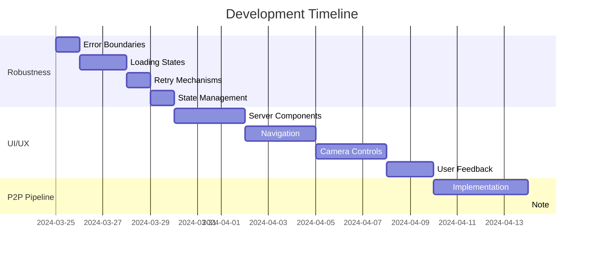
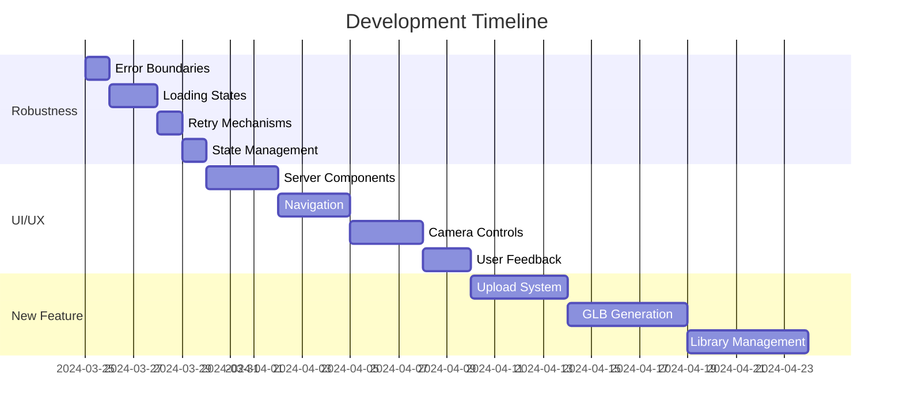

# Modern 3D Viewer - Development Roadmap 2024

## Overview
This document outlines the prioritized development plan for the Modern 3D Viewer application, focusing on stability, user experience, and feature expansion. The priorities are structured to build upon each other, ensuring a solid foundation for future development.

## Sprint 1: Improve Application Robustness ✅
**Timeline: 3-5 days** ✅ (Completed March 24, 2025)

### Key Improvements
1. **Error Boundaries** ✅
   - Implement component-level error catching
   - Create meaningful error recovery UIs
   - Add error reporting and logging
   - Preserve user state during errors

2. **Loading States** ✅
   - Add loading indicators for async operations
   - Implement skeleton loading states
   - Create progress indicators for long operations
   - Handle timeout scenarios

3. **Retry Mechanisms** ✅
   - Add automatic retry for API calls
   - Implement exponential backoff
   - Create manual retry options
   - Preserve partial progress

4. **State Management** ✅
   - Add TypeScript types for all state
   - Implement state validation
   - Add state persistence where needed
   - Create state recovery mechanisms

### Success Criteria
- [x] Zero uncaught runtime errors
- [x] All async operations have loading states
- [x] Failed operations have retry mechanisms
- [x] All state changes are type-safe

## Sprint 2: UI/UX Improvements ✅
**Timeline: 7-10 days** ✅ (Completed March 27, 2025)

### Server-Side Component Migration ✅ (Completed March 24, 2025)
```typescript
// Key Areas for Server Components
1. **Dynamic Routes & Data Fetching**
   - Fix `createServerClient` implementation
   - Update `/viewer/[modelId]` page to use proper async patterns
   - Implement proper params handling in dynamic routes
   - Set up proper error boundaries for SSR failures

2. **State Management**
   - Separate client/server state
   - Implement proper hydration strategies
   - Handle loading and error states
   - Set up proper data revalidation

3. **Authentication Flow**
   - Move auth checks to server components
   - Implement proper session handling
   - Set up middleware for protected routes
```

### Navigation Enhancements ✅ (Completed March 24, 2025)
```typescript
// Example of improved navigation handling
const Navigation = () => {
  const router = useRouter()
  const toast = useToast()
  
  const handleNavigation = async (path: string) => {
    try {
      await router.push(path)
    } catch (error) {
      toast({
        title: "Navigation failed",
        description: "Please try again",
        status: "error"
      })
    }
  }
}
```

### UI Layout Revamp ✅ (Completed March 25, 2025)
1. **Component Reorganization**
   - Optimized Cast container positioning
   - Improved Scene Controls layout
   - Enhanced Camera Animation System placement
   - Strategic Telemetry positioning

2. **Visual Hierarchy**
   - Clear component separation
   - Proper spacing implementation
   - Improved user interaction flow
   - Maintained consistent styling

3. **Technical Implementation**
   - Enhanced state management
   - Proper event handling
   - Z-index layer management

### User Feedback ✅ (Completed March 27, 2025)
1. **Enhanced toast notifications**
2. **Clear success/error states**
3. **Operation progress tracking**
4. **Helpful error recovery**

### Success Criteria
- [x] Server components properly handle dynamic routes
- [x] No hydration mismatches or warnings
- [x] Navigation feels smooth and reliable
- [x] Users receive clear feedback
- [x] UI components are properly positioned and spaced
- [x] Component interactions are intuitive and reliable

## Sprint 3: LLM Provider Switching ✅
**Timeline: 5-7 days** ✅ (Completed April 10, 2025)

### Feature Overview
Implement an admin interface to switch between different LLM providers (OpenAI and Google Gemini) for camera path generation, with proper authentication and configuration management.

### Implementation Phases
1. **Core Infrastructure (2-3 days)** ✅
   ```typescript
   interface LLMProvider {
     generateCameraPath(params: PathGenerationParams): Promise<CameraPath>;
     validateConfiguration(): Promise<boolean>;
     getCapabilities(): ProviderCapabilities;
   }
   ```

2. **Admin Interface (2 days)** ✅
   - Create protected admin routes
   - Build provider configuration UI
   - Implement provider switching logic
   - Add monitoring and logging

3. **Integration & Testing (1-2 days)** ✅
   - Update camera path generation
   - Add error handling and fallbacks
   - Implement monitoring
   - Add documentation

### Success Criteria
- [x] Admin interface is secure and accessible
- [x] Provider switching works seamlessly
- [x] Configuration management is robust
- [x] Error handling covers all scenarios
- [x] Monitoring provides clear insights
- [x] Documentation is comprehensive

## Sprint 4: Path-to-Path (p2p) Pipeline Implementation 📦 (Archived)
> ⚠️ **Note**: This sprint has been revised and migrated to Asana for active task tracking. The content below is preserved for historical reference only. For current implementation details and status, see [P2P Pipeline Overview v2](./features/camera-animation/P2P_OVERVIEW_v2.md).

**Timeline: 14-21 days**

### Feature Overview
Implement the complete Path-to-Path pipeline, transforming the current basic camera path generation into a sophisticated, modular system with enhanced capabilities and better user experience.

### Implementation Phases

#### Phase 1: Prompt Compiler Enhancement (4-5 days)
```typescript
interface PromptCompiler {
  // Core functionality
  compilePrompt: (params: PromptParams) => Promise<CompiledPrompt>;
  optimizeTokens: (prompt: string) => Promise<string>;
  trackMetadata: (prompt: CompiledPrompt) => Promise<void>;
  
  // Advanced features
  addSceneContext: (prompt: string, scene: SceneGeometry) => string;
  formatForLLM: (prompt: string, format: 'chatml' | 'json' | 'markdown') => string;
}

interface PromptParams {
  userInstruction: string;
  sceneGeometry: SceneGeometry;
  duration: number;
  style?: 'cinematic' | 'technical' | 'documentary';
  verbosity?: 'concise' | 'detailed';
}
```

#### Phase 2: LLM Engine Enhancement (4-5 days)
```typescript
interface LLMEngine {
  // Core functionality
  generatePath: (params: PathGenerationParams) => Promise<CameraPath>;
  validateResponse: (response: any) => Promise<boolean>;
  
  // Advanced features
  parseIntent: (prompt: string) => Promise<CameraIntent>;
  composeSegments: (intent: CameraIntent) => Promise<MotionSegment[]>;
  applySpatialReasoning: (segments: MotionSegment[], scene: SceneGeometry) => Promise<MotionSegment[]>;
}

interface MotionSegment {
  type: 'push-in' | 'orbit' | 'crane' | 'track' | 'static';
  duration: number;
  easing?: 'linear' | 'ease-in' | 'ease-out' | 'ease-in-out';
  parameters: Record<string, any>;
}
```

#### Phase 3: Viewer Integration Enhancement (2-3 days)
```typescript
interface ViewerIntegration {
  // Core functionality
  animateCamera: (frames: Frame[]) => Promise<void>;
  renderPreview: (path: CameraPath) => void;
  
  // Advanced features
  exportPath: (path: CameraPath, format: 'video' | 'gif' | 'json') => Promise<string>;
  editPath: (path: CameraPath) => Promise<CameraPath>;
}
```

### Success Criteria
- [ ] Prompt Compiler
  - [ ] Structured prompt formatting
  - [ ] Token optimization
  - [ ] Metadata tracking
  - [ ] Scene context integration

- [ ] LLM Engine
  - [ ] Motion segment support
  - [ ] Spatial reasoning
  - [ ] Camera framing
  - [ ] Response validation

- [ ] Viewer Integration
  - [ ] Smooth animation
  - [ ] Preview rendering
  - [ ] Export capabilities
  - [ ] Path editing

### Technical Considerations
1. **Performance**
   - Optimize prompt compilation
   - Efficient interpolation
   - Smooth preview rendering
   - Background processing

2. **Error Handling**
   - Graceful fallbacks
   - User-friendly errors
   - Recovery mechanisms
   - State preservation

3. **Testing**
   - Unit tests for each component
   - Integration tests
   - Performance benchmarks
   - User experience testing

4. **Documentation**
   - API documentation
   - Usage examples
   - Architecture diagrams
   - Troubleshooting guides

### Resource Requirements
- 1 Full-time developer
- 1 Part-time UX designer
- 1 Part-time QA engineer
- Access to LLM APIs
- Testing infrastructure

### Risk Assessment
1. **Technical Risks**
   - LLM response consistency
   - Performance with complex paths
   - Browser compatibility
   - Memory management

2. **Mitigation Strategies**
   - Comprehensive testing
   - Performance monitoring
   - Fallback mechanisms
   - Regular reviews

### Timeline Overview


## Timeline Overview


## Resource Requirements

### Development Resources
- 1 Full-time developer
- 1 Part-time UX designer (for UI/UX phase)
- 1 Part-time QA engineer

### Infrastructure
- Image storage solution
- GLB processing service
- Enhanced error tracking
- Analytics system

## Risk Assessment

### Technical Risks
1. **GLB Generation Quality**
   - Mitigation: Implement quality checks
   - Fallback: Manual quality adjustment options

2. **Performance Impact**
   - Mitigation: Implement lazy loading
   - Fallback: Reduce feature scope

3. **Storage Costs**
   - Mitigation: Implement file size limits
   - Fallback: User quotas

### Mitigation Strategies
1. Regular testing throughout development
2. Phased rollout of features
3. Monitoring and alerting setup
4. User feedback collection

## Success Metrics

### Technical Metrics
- Error rate < 0.1%
- Page load time < 2s
- GLB generation success > 95%
- API response time < 500ms

### User Metrics
- User satisfaction > 4/5
- Feature adoption > 50%
- Return usage > 70%
- Support tickets < 5/week

## Maintenance Plan

### Regular Tasks
1. Weekly code reviews
2. Daily error log review
3. Monthly performance audit
4. Bi-weekly user feedback review

### Long-term Considerations
1. Scale infrastructure as needed
2. Update dependencies regularly
3. Refine based on usage patterns
4. Implement user suggestions

## Conclusion
This roadmap provides a structured approach to improving and expanding the Modern 3D Viewer application. By prioritizing stability and user experience before adding new features, we ensure a solid foundation for future development. Regular reviews and adjustments to this plan will be necessary as development progresses.

## Parking Lot 📦 (Archived)
> ⚠️ **Note**: All tasks from this section have been revised and migrated to Asana for active tracking. The content below is preserved for historical reference only.

Items in this section were features or improvements that were identified but not initially prioritized in the main development roadmap. These have now been evaluated, refined, and moved to Asana for proper task management and tracking.

**Migrated Features**:
- Camera Controls Enhancement
- User Feedback System Review
- Scene Interpreter Enhancement
- Feedback & Logging System
- Model Thumbnails Feature

For current task status and implementation details, please refer to Asana project board.

---

> 🔄 This document has been archived as task management has moved to Asana. Please refer to project documentation for current architectural decisions and implementation details. 