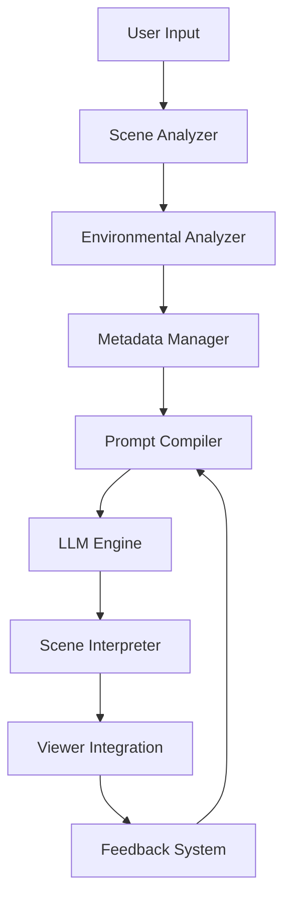

# Path-to-Path (p2p) Pipeline Architecture

## Overview
The Path-to-Path (p2p) pipeline is a sophisticated system that translates natural language instructions into dynamic camera paths within a Three.js scene. This document outlines the overall architecture and component interactions.

## Pipeline Components

### 1. Scene Analyzer
- **Purpose**: Analyze and understand 3D scene structure and spatial relationships
- **Key Features**:
  - GLB file parsing and analysis
  - Spatial reference point extraction
  - Safety boundary calculation
  - Basic scene understanding
- **Interface**: See [Scene Analyzer Documentation](./scene-analyzer/README.md)

### 2. Environmental Analyzer
- **Purpose**: Analyze environmental factors and constraints
- **Key Features**:
  - Lighting analysis and optimization
  - Material property analysis
  - Environmental constraint detection
  - Performance optimization
- **Interface**: See [Environmental Analyzer Documentation](./environmental-analyzer/README.md)

### 3. Metadata Manager
- **Purpose**: Handle user-specified metadata and model information
- **Key Features**:
  - User metadata storage
  - Model orientation handling
  - Feature point tracking
  - Database integration
- **Interface**: See [Metadata Manager Documentation](./metadata-manager/README.md)

### 4. Prompt Compiler
- **Purpose**: Transform user instructions into optimized LLM prompts
- **Key Features**:
  - Natural language processing
  - Scene context integration
  - Token optimization
  - Metadata tracking
- **Interface**: See [Prompt Compiler Documentation](./prompt-compiler/README.md)

### 5. LLM Engine
- **Purpose**: Manage interaction with external LLM services to generate camera paths from compiled prompts.
- **Key Features**:
  - LLM provider selection (OpenAI, Gemini, etc.)
  - API request formatting and transmission
  - Handling of provider-specific requirements
  - API response reception and initial validation/parsing
  - Error handling for API communication
  - (Future) Retry and fallback logic
- **Interface**: See [LLM Engine Documentation](./llm-engine/README.md)

### 6. Scene Interpreter
- **Purpose**: Convert LLM output into executable camera paths
- **Key Features**:
  - Motion segment parsing
  - Advanced interpolation
  - Safety validation
  - Path preview
- **Interface**: See [Scene Interpreter Documentation](./scene-interpreter/README.md)

### 7. Viewer Integration
- **Purpose**: Execute and visualize camera paths
- **Key Features**:
  - Camera animation
  - Path preview
  - Interactive controls
  - Export capabilities
- **Interface**: See [Viewer Integration Documentation](./viewer-integration/README.md)

### 8. Feedback System
- **Purpose**: Monitor and improve pipeline performance
- **Key Features**:
  - Session logging
  - User feedback collection
  - Health monitoring
  - Training data preparation
- **Interface**: See [Feedback System Documentation](./feedback/README.md)

## Component Interactions

## Data Flow

1. **Scene Analysis**
   - GLB file is parsed and analyzed
   - Spatial relationships are extracted
   - Safety boundaries are calculated

2. **Environmental Analysis**
   - Lighting conditions are analyzed
   - Material properties are extracted
   - Environmental constraints are identified
   - Performance optimizations are applied

3. **Metadata Processing**
   - User metadata is retrieved
   - Model information is processed
   - Feature points are identified

4. **Input Processing**
   - User provides natural language instruction
   - Scene context is gathered
   - Duration and constraints are specified

5. **Prompt Generation**
   - Prompt Compiler processes input
   - Optimizes for LLM consumption
   - Adds necessary context

6. **LLM Interaction & Path Generation**
   - LLM Engine selects provider
   - Sends compiled prompt to external LLM service
   - External LLM generates motion segments (keyframes)
   - LLM Engine receives response, validates, and parses keyframes

7. **Path Interpretation & Validation**
   - Scene Interpreter processes keyframes
   - Interpolates motion, applies easing
   - Performs detailed safety checks

8. **Execution**
   - Viewer Integration executes path
   - Provides interactive controls
   - Enables export options

9. **Feedback Loop**
   - System collects performance data
   - User feedback is gathered
   - Improvements are identified

## Error Handling

### 1. Component-Level Errors
- Each component handles its own errors
- Provides meaningful error messages
- Implements fallback strategies

### 2. Pipeline-Level Errors
- Graceful degradation
- State preservation
- Recovery mechanisms

## Performance Considerations

### 1. Optimization Points
- GLB parsing efficiency
- Environmental analysis
- Metadata management
- Prompt token management
- Path generation efficiency
- Animation smoothness
- Memory usage

### 2. Monitoring
- Response times
- Error rates
- Resource usage
- User satisfaction

## Development Guidelines

### 1. Component Development
- Follow TypeScript best practices
- Implement comprehensive testing
- Document interfaces thoroughly
- Maintain backward compatibility

### 2. Integration Testing
- Test component interactions
- Validate data flow
- Check error handling
- Measure performance

## Future Enhancements

### 1. Planned Features
- Advanced GLB analysis
- Enhanced environmental understanding
- Improved metadata management
- Better performance monitoring

### 2. Research Areas
- GLB processing optimization
- Environmental analysis improvement
- User experience enhancement
- Performance optimization

## Related Documentation
- [Product Requirements Document](../../PRD.md)
- [Technical Design Document](../../TECHNICAL_DESIGN.md)
- [Development Roadmap](../../DEVELOPMENT_ROADMAP.md)
- [P2P Development Roadmap](./P2P_DEVELOPMENT_ROADMAP.md)
- [Original Pipeline Overview](./P2P_OVERVIEW.md) 