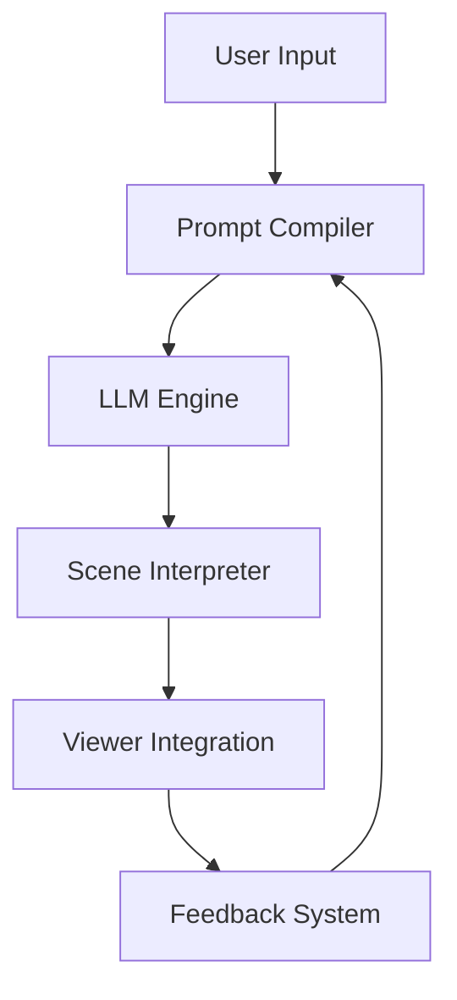

# Path-to-Path (p2p) Pipeline Architecture

## Overview
The Path-to-Path (p2p) pipeline is a sophisticated system that translates natural language instructions into dynamic camera paths within a Three.js scene. This document outlines the overall architecture and component interactions.

## Pipeline Components

### 1. Prompt Compiler
- **Purpose**: Transform user instructions into optimized LLM prompts
- **Key Features**:
  - Natural language processing
  - Scene context integration
  - Token optimization
  - Metadata tracking
- **Interface**: See [Prompt Compiler Documentation](./prompt-compiler/README.md)

### 2. LLM Engine
- **Purpose**: Generate camera paths from compiled prompts
- **Key Features**:
  - Intent parsing
  - Motion segment composition
  - Spatial reasoning
  - Response validation
- **Interface**: See [LLM Engine Documentation](./llm-engine/README.md)

### 3. Scene Interpreter
- **Purpose**: Convert LLM output into executable camera paths
- **Key Features**:
  - Motion segment parsing
  - Advanced interpolation
  - Safety validation
  - Path preview
- **Interface**: See [Scene Interpreter Documentation](./scene-interpreter/README.md)

### 4. Viewer Integration
- **Purpose**: Execute and visualize camera paths
- **Key Features**:
  - Camera animation
  - Path preview
  - Interactive controls
  - Export capabilities
- **Interface**: See [Viewer Integration Documentation](./viewer-integration/README.md)

### 5. Feedback System
- **Purpose**: Monitor and improve pipeline performance
- **Key Features**:
  - Session logging
  - User feedback collection
  - Health monitoring
  - Training data preparation
- **Interface**: See [Feedback System Documentation](./feedback/README.md)

## Component Interactions

## Data Flow

1. **Input Processing**
   - User provides natural language instruction
   - Scene context is gathered
   - Duration and constraints are specified

2. **Prompt Generation**
   - Prompt Compiler processes input
   - Optimizes for LLM consumption
   - Adds necessary context

3. **Path Generation**
   - LLM generates motion segments
   - Scene Interpreter validates and processes
   - Safety checks are applied

4. **Execution**
   - Viewer Integration executes path
   - Provides interactive controls
   - Enables export options

5. **Feedback Loop**
   - System collects performance data
   - User feedback is gathered
   - Improvements are identified

## Error Handling

### 1. Component-Level Errors
- Each component handles its own errors
- Provides meaningful error messages
- Implements fallback strategies

### 2. Pipeline-Level Errors
- Graceful degradation
- State preservation
- Recovery mechanisms

## Performance Considerations

### 1. Optimization Points
- Prompt token management
- Path generation efficiency
- Animation smoothness
- Memory usage

### 2. Monitoring
- Response times
- Error rates
- Resource usage
- User satisfaction

## Development Guidelines

### 1. Component Development
- Follow TypeScript best practices
- Implement comprehensive testing
- Document interfaces thoroughly
- Maintain backward compatibility

### 2. Integration Testing
- Test component interactions
- Validate data flow
- Check error handling
- Measure performance

## Future Enhancements

### 1. Planned Features
- Advanced motion types
- Enhanced preview capabilities
- Improved error recovery
- Better performance monitoring

### 2. Research Areas
- LLM optimization
- Motion quality improvement
- User experience enhancement
- Performance optimization

## Related Documentation
- [Product Requirements Document](../../PRD.md)
- [Technical Design Document](../../TECHNICAL_DESIGN.md)
- [Development Roadmap](../../DEVELOPMENT_ROADMAP.md)
- [Original Pipeline Overview](./P2P_OVERVIEW.md) 